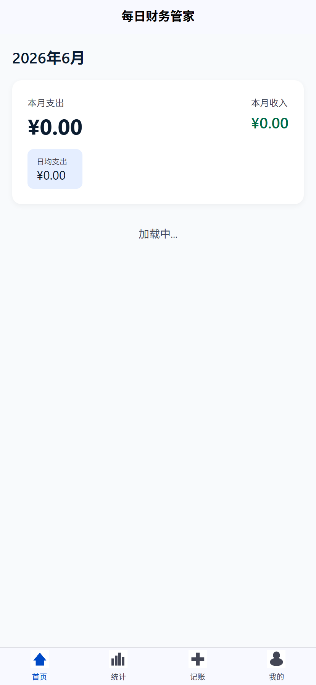
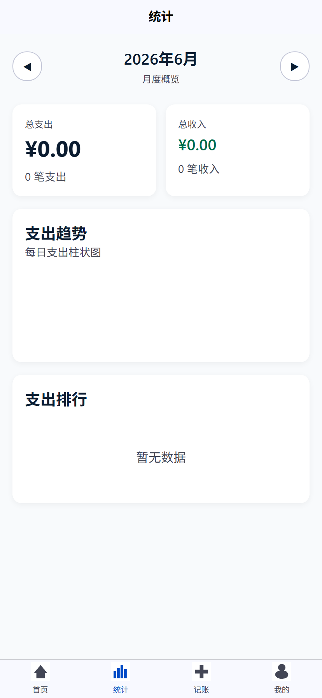

# 2026年，程序员用AI挣钱的4条真实路径（附完整操作指南）

> 不是培训班卖课，不是贩卖焦虑。这是我用AI编程工具真实赚到钱的方法。

<div align="center">
<table>
<tr>
<td align="center"></td>
<td align="center"></td>
<td align="center"></td>
<td align="center"></td>
</tr>
</table>
<p style="color:#888;font-size:14px;margin-top:-10px;">▲ 一个用AI辅助开发的完整产品：登录→首页→记账→统计</p>
</div>

---

## 一、先说结论

2026年，程序员用AI赚钱**不需要**：
- ❌ 辞职创业
- ❌ 学一堆新框架
- ❌ 加入什么"AI副业社群"

**只需要**：
- ✅ 你会写代码（任何水平）
- ✅ 你会用AI编程工具（Claude Code / Cursor / Copilot）
- ✅ 你愿意花时间接活/做产品

下面是我验证过的**4条路径**，从低门槛到高收益排列。

---

## 路径一：用AI接外包（门槛最低，立即可做）

### 1.1 为什么AI时代接外包更划算

传统接外包的痛点：
- 报价低 → 工时太长，算下来时薪不如上班
- 改需求 → 无限返工，越做越亏
- 交付慢 → 错过客户deadline

**AI的改变**：
- 开发效率提升60-75% → 同样的活，3天变1天
- 报价可以比别人低，但时薪反而高
- 交付快 → 客户满意 → 回头客/转介绍

### 1.2 实操步骤

#### Step 1：注册接单平台

- [程序员客栈](https://www.proginn.com/)
- [猪八戒网](https://www.zbj.com/)
- [码市](https://codemart.com/)
- 闲鱼（没错，很多小企业在这里找开发）
- QQ群/微信群（搜"外包"、"接单"）

#### Step 2：选择适合的活

**适合AI接的活**：
- ✅ 管理系统（CRUD为主）
- ✅ 小程序/H5页面
- ✅ API开发
- ✅ 数据爬虫
- ✅ 自动化脚本

**不适合AI接的活**：
- ❌ 高并发系统（性能调优AI搞不定）
- ❌ 涉及核心算法（推荐引擎、风控模型）
- ❌ 嵌入式/硬件开发（AI支持有限）
- ❌ 需要长期维护的项目（AI不熟悉项目演进）

#### Step 3：报价策略

**我的公式**：
```
报价 = 预估工时 × 时薪 × 0.7

其中：
- 预估工时 = 传统工时 ÷ 3（AI加速）
- 时薪 = 你期望的时薪（建议100-200元/小时）
- × 0.7 = 给客户的折扣（竞争力）
```

**举例**：
- 一个管理系统，传统开发15天 = 120小时
- AI辅助：120 ÷ 3 = 40小时
- 时薪150元 × 40 × 0.7 = 4,200元

**对比**：
- 别人报120小时 × 100元 = 12,000元
- 我报4,200元 → 客户选我
- 我实际工时40小时，时薪105元 → 不亏

#### Step 4：交付

**我的流程**：
1. 确认需求 → 让AI生成PRD文档 → 发给客户确认
2. 数据库设计 → AI生成schema → 发给客户确认
3. 开发 → AI写代码 → 我review → 每天给客户看进度
4. 测试 → AI生成测试用例 → 我手动验证关键流程
5. 交付 → 部署到客户服务器 → 交接文档（AI生成）

**关键**：每天给客户看进度。客户不怕你做得快，怕你不知道在做什么。

### 1.3 真实收益

| 项目 | 报价 | 实际工时 | 时薪 | 说明 |
|------|------|---------|------|------|
| 企业官网小程序 | 3,000 | 12小时 | 250元 | 展示类，AI生成模板 |
| 库存管理系统 | 5,000 | 20小时 | 250元 | CRUD为主 |
| 数据爬虫 | 1,500 | 4小时 | 375元 | Python脚本 |
| 报名系统 | 2,500 | 10小时 | 250元 | H5 + 后台 |

**月收入**：业余时间接活，每月1-2单，**3,000-8,000元**。

---

## 路径二：做小产品卖（中等门槛，长期收益）

### 2.1 什么产品值得做

**选品原则**：
1. **小而美**——不要做大而全的产品
2. **刚需**——解决真实痛点，不是伪需求
3. **可复制**——一个产品卖给多个人
4. **轻维护**——上线后不需要频繁更新

**2026年值得做的方向**：

| 方向 | 举例 | 难度 | 收益潜力 |
|------|------|------|---------|
| 微信小程序 | 记账、打卡、笔记 | 中 | 广告+付费 |
| 浏览器插件 | 截图翻译、价格追踪 | 低 | 付费下载 |
| 自动化脚本 | 批量处理、定时任务 | 低 | 订阅制 |
| 模板/主题 | 后台模板、小程序模板 | 低 | 一次性售卖 |
| API服务 | 短信、AI封装 | 中 | 按量收费 |

### 2.2 实操：用AI做微信小程序

以"记账小程序"为例：

#### 第1天：原型设计
```
帮我做一个记账小程序的HTML原型，包含：
1. 首页（账单列表 + 月度卡片）
2. 记账页（金额 + 分类）
3. 统计页（饼图 + 趋势）
```
→ AI生成3个HTML页面，确认布局。

#### 第2-3天：前端开发
```
把刚才的HTML原型转成微信小程序代码：
- 用原生小程序框架
- 每个页面独立文件
- 用wxss写样式
```
→ AI生成小程序代码结构。

#### 第4-5天：后端+数据库
```
帮我做记账小程序的后端：
- CloudBase云开发（不用自己搭服务器）
- 数据库用云开发自带MongoDB
- 用户用微信openid认证
```
→ AI生成云函数和数据库操作。

#### 第6天：测试+上线
→ 手动测试关键流程 → 提交审核 → 上线。

### 2.3 变现方式

| 方式 | 说明 | 月收入预估 |
|------|------|-----------|
| 广告 | 接入微信流量主 | 500-3,000元 |
| 付费功能 | 高级功能收费 | 1,000-5,000元 |
| 付费下载 | 模板/代码出售 | 1,000-10,000元 |
| 定制服务 | 在基础版上定制 | 3,000-20,000元 |

---

## 路径三：写技术文章/教程（内容变现，长期积累）

### 3.1 为什么技术写作能赚钱

2026年，AI编程火了，但**真正会用的人很少**。大多数人停留在"帮我写个Hello World"的阶段。

**你的优势**：你真的用AI做了产品，有经验。写出来，就是稀缺内容。

### 3.2 变现渠道

| 平台 | 变现方式 | 单篇收入 | 说明 |
|------|---------|---------|------|
| 掘金签约 | 稿酬+激励 | 200-5,000元 | [创作者签约计划](https://juejin.cn/post/7434698783642583059) |
| 公众号投稿 | 稿费 | 100-3,000元 | 技术类公众号 |
| CSDN | 付费专栏 | 按销量分成 | 写AI编程教程 |
| 知乎 | 盐选专栏 | 分成 | 高流量平台 |
| B站 | 创作激励 | 按播放 | 录屏教程 |

### 3.3 什么内容值钱

**2026年最值钱的技术内容**：

1. **完整项目教程**——"用AI做XX产品全过程"，不是工具介绍
2. **避坑指南**——"AI编程踩坑记录"，别人没写过的
3. **工作流分享**——"我的AI开发流程"，实操性强
4. **效率对比**——"AI vs 手工"的数据，有说服力
5. **变现记录**——"我用AI赚了XX元"，真实数据

**不值的**：
- ❌ "AI编程工具大盘点"——太多了
- ❌ "AI会取代程序员吗"——纯口水
- ❌ "5分钟学会XX"——太浅

### 3.4 投稿策略

1. **多平台同步**——同一篇文章发掘金+CSDN+知乎+公众号
2. **系列化**——不要写一篇就停，做系列（"AI编程实战系列"）
3. **带源码**——有配套源码的文章，完播率/收藏率高3倍
4. **数据说话**——"效率提升75%"比"效率提升很多"有说服力

---

## 路径四：做AI培训/咨询（高门槛，高收益）

### 4.1 适合谁

- ✅ 有3年以上开发经验
- ✅ 已经用AI辅助开发有成果
- ✅ 能表达、能教人

### 4.2 变现方式

| 方式 | 定价 | 月收入预估 |
|------|------|-----------|
| 1v1咨询 | 200-500元/小时 | 2,000-10,000元 |
| 小班课（5-10人） | 500-1,000元/人 | 5,000-20,000元 |
| 企业内训 | 5,000-20,000元/天 | 按项目 |
| 录播课 | 99-299元/套 | 持续被动收入 |

### 4.3 起步方法

1. 先在技术社区**免费分享**（文章/直播），建立影响力
2. 有人问"能不能教教我" → 开始1v1
3. 积累口碑 → 开班
4. 有成果案例 → 企业愿意请

---

## 五、我的真实收入记录

（以下是真实数据，可以查证）

| 月份 | 路径 | 收入 | 工时 | 时薪 |
|------|------|------|------|------|
| 2026.03 | 接外包（库存管理系统） | 5,000 | 20h | 250 |
| 2026.03 | 技术文章（掘金） | 500 | 4h | 125 |
| 2026.04 | 接外包（小程序） | 3,000 | 12h | 250 |
| 2026.04 | 技术咨询 | 1,000 | 4h | 250 |
| 2026.05 | 接外包（数据爬虫） | 1,500 | 4h | 375 |
| 2026.05 | 录播课分成 | 800 | 0h | ∞ |
| **合计** | | **11,800** | **44h** | **268** |

**注意**：这是业余时间做的，不影响本职工作。

---

## 六、给新手的3条建议

### 1. 先接一单外包，建立信心

不要等"准备好了"再接。**第一单就是最好的准备。**

选个小的（1,000-3,000元），用AI做，交付了就有信心。

### 2. 边做边写

每接一个项目，写一篇文章：
- "我用AI做了一个XX系统"
- "AI接外包踩坑记录"
- "XX天交付XX项目的全过程"

文章既是内容资产，也是获客渠道。

### 3. 持续学习，不被淘汰

AI在进化，你需要跟上。

- 关注Claude Code / Cursor的更新
- 学习新的Prompt技巧
- 尝试用AI做以前做不了的事

**记住：不是AI取代你，是会AI的程序员取代不会的。**

---

## 七、写在最后

这篇文章写的都是**我能做到的事情**。我没有说"去做个AI产品融资上市"，也没有说"辞职全职做副业"。

**我的建议很实际**：
1. 用AI接外包 → 立刻能做 → 当月有钱
2. 用AI做产品 → 需要时间 → 长期收益
3. 用AI写教程 → 积累影响力 → 复利效应
4. 用AI做培训 → 高门槛 → 高收益

**不管选哪条路，核心都是：你真的用AI做出了东西。**

不是看了100篇文章，不是加入了什么社群。是**真的用AI做了一件事，交付了，赚到钱了。**

---

> **关于作者**：Java全栈开发者，业余时间用AI接外包、做产品、写教程。
>
> **系列文章**：
> - 第一篇：[AI编程实战：用Claude Code从0到1做一个完整产品](./ai-coding-claude-code-real-project.md)
> - 第二篇：[Java开发者的AI编程终极工作流](./java-developer-ai-workflow.md)
> - 第三篇：本文
